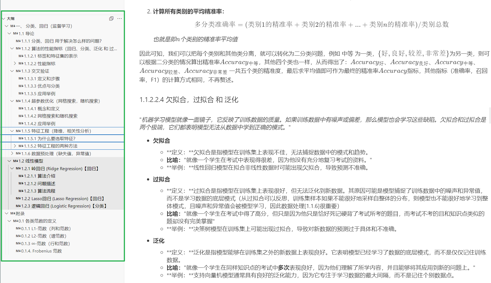

# Mathematical_Modeling

**All for further progress!!!**

这里存放着机器学习的入门教学，面向于数学建模的学习资料，安装好Jupyter Notebook后，请从 “机器学习.ipynb” 开始阅读~

## 1. 阅读准备

### 1.1. Jupyter Notebook介绍

Jupyter Notebook是一个开源的Web应用程序，允许用户创建和共享包含代码、方程、可视化和文本的文档。它的用途包括：数据清理和转换、数值模拟、统计建模、机器学习等等。

### 1.2. 安装Jupyter Notebook

在有Python的环境下，直接在终端输入以下命令即可：

```shell
pip install jupyter
```
安装好后即可在Cursor或VSCode中打开'.ipynb'文件了

### 1.3. 在Cursor或VSCode中打开'.ipynb'文件

在大纲页面会显示文章目录和小结，点击即可跳转到相应的位置，方便阅读：



另外建议大家用白色的背景，这样看起来更舒服，具体位置在：“文件”→“首选项”→“颜色主题”→“主题”→“浅色”→“现代浅色”（推荐）


### 给开发者的话：

更新方式:

```
$ git add .
$ git commit -m "new"
$ git push origin master
```
